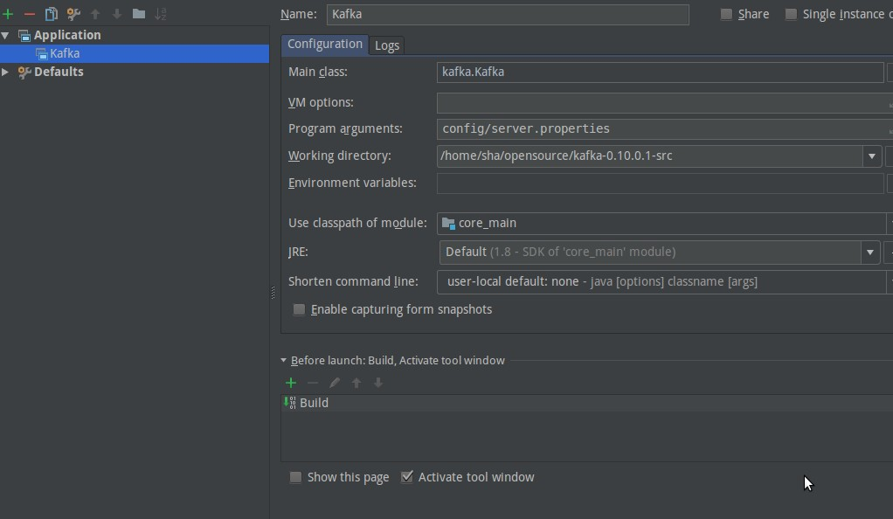

# Kafka源码调试环境搭建  

## 安装gradle  

这里使用sdk方式安装，版本4.9

* 安装sdkman

```shell
curl -s "https://get.sdkman.io" | bash
```

* 安装gradle 4.9

```shell
sdk install gradle 4.9
```

## 下载kafka源码

这里使用0.10.0.1版本，下载地址：
https://archive.apache.org/dist/kafka/0.10.0.1/kafka-0.10.0.1-src.tgz

同时把二进制文件也下载下来，使用其中的编译好的工具进行测试
https://archive.apache.org/dist/kafka/0.10.0.1/kafka_2.11-0.10.0.1.tgz

解压：

```shell
tar zxvf kafka-0.10.0.1-src.tgz
```

## 源码构建

使用gradle idea构建项目，用国外的库构建的下载速度很慢，在进入项目里面，找到build.gradle文件的修改库为阿里镜像库

```gradle
buildscript {
  repositories {
        maven{ url 'http://maven.aliyun.com/nexus/content/groups/public/'}
    }
  apply from: file('gradle/buildscript.gradle'), to: buildscript
  dependencies {
    // For Apache Rat plugin to ignore non-Git files
    classpath "org.ajoberstar:grgit:1.5.0"
    classpath 'com.github.ben-manes:gradle-versions-plugin:0.12.0'
    classpath 'org.scoverage:gradle-scoverage:2.0.1'
  }

}

allprojects {

  apply plugin: 'idea'
  apply plugin: 'eclipse'
  apply plugin: "jacoco"

  allprojects {
    repositories {
        maven{ url 'http://maven.aliyun.com/nexus/content/groups/public/'}

    }
}
```

再在build.gradle里加上以下几行

```gradle
ScalaCompileOptions.metaClass.daemonServer = true  
ScalaCompileOptions.metaClass.fork = true
ScalaCompileOptions.metaClass.useAnt = false  
ScalaCompileOptions.metaClass.useCompileDaemon = false
```

否则会报异常

```shell
* What went wrong:  
A problem occurred evaluating root project 'kafka-0.10.0.1-src'.  
> Failed to apply plugin [class 'org.gradle.api.plugins.scala.ScalaBasePlugin']  

   > No such property: useAnt for class: org.gradle.api.tasks.scala.ScalaCompileOptions  

* Try:  

Run with --stacktrace option to get the stack trace. Run with --info or --debug option to get more log output.  

BUILD FAILED  
```

## Idea设置

用idea打开源码

* 安装scala插件

    在安装插件里搜"Scala"，安装

* 安装scala SDK
  
   打开scala文件时idea会提示安装sdk,按照向导安装

* 设置启动参数
  
  

* 配置log
  
  在core/src/main下新建resources文件夹，把config下的log4.properties复制到resources里

  把log4.properties里的${kafka.logs.dir}替换成指定目录，这里用/tmp/kafka/

## 运行验证

kafka依赖zookeeper，所以在运行kafka之前，先运行zookeeper.

下载zookeeper解压, cd bin目录下，运行

```shell
./zkServer.sh start
```

采用默认配置，端口2181

### run kafka

使用**二进制包**里的工具验证, 注意这里不是源码包里的工具。

* 创建topic

```shell
./kafka-topics.sh --create --zookeeper localhost:2181 --replication-factor 1 --partitions 1 --topic testMsg
```

* 生产者发消息

```shell
./kafka-console-producer.sh --broker-list localhost:9092 --topic testMsg
```

* 消费者消费消息

```shell
./kafka-console-consumer.sh --zookeeper localhost:2181 --topic testMsg
```


* 查看log文件

```shell
bin/kafka-run-class.sh kafka.tools.DumpLogSegments --files /tmp/kafka-logs/test-0/00000000000000000000.log  --print-data-log
```