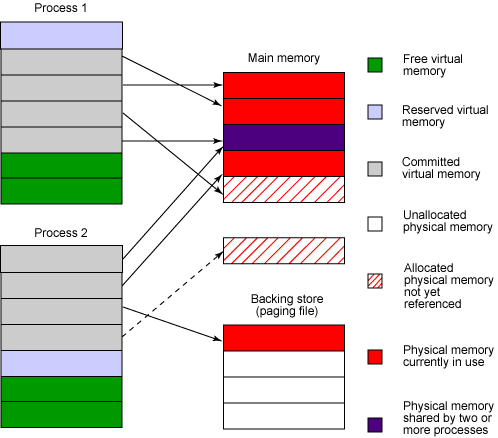

# Java应用堆内存占用

>我们都知道, 对于JVM, -Xmx指定堆最大占用内存空间大小, -Xms指定堆初始占用内存大小.  
假设-Xmx4g, -Xms1g, 那么此时占用的实际内存大小是1g还是4g? 相信大家都知道是1g, 那么这里的4g究竟有什么意义, 操作系统是如果保证当jvm需要扩展内存时可以分配出4g内存的?

## Reserved Memory VS Committed Memory

首先明确一点, -Xmx实际指定的reserved memory, -Xms指定的committed memory, reserved和committed memory分别代表什么意义呢? 要理解这两个概念,首先要了解下**虚拟内存**

### 虚拟内存

进程在占用内存时并不是直接划定物理内存使用范围, 而是先在虚拟内存空间上进行分配. 虚拟内存和实际的物理内存通过被称为**页表**的数据结构进行映射转换.

在操作系统中虚拟内存被分为大小相等的单元,这些单元被称为**页**, 操作系统中的每个进程都被分配了属于它自己的虚拟内存空间,也就是一些**页**,每个页会处于以下三种状态之一:

**Free**: 进程还没有使用这部分虚拟内存空间(页), 试图对这些页的写入或读取访问都会引起运行时失败. 当处于free状态的页要被使用时, 它必须首先被分配为reserved或committed状态, 注意这里成为committed状态并不必须首先成为reserved状态.

**Reserved**: 处于这种状态的页是进程为将来使用而保留的, 它们还没有和实际的物理内存进行关联, 这些页不能被访问, 除非它们被committed. -Xmx的值就是指定这种状态页的总大小.

**Committed** : 处于这种状态的页已经和物理内存进行了映射, 进程可以直接访问.

图1说明了上述关系:

## -Xmx和-Xms

理解了reserved memory和committed memory, 就很容易理解-Xmx和-Xms的含义了. 回到开头的例子, -Xmx4g表示应用在虚拟内存,也就是页上分配了4g的空间大小, 而这部分实际上并没有与实际物理内存关联, 也就是并没有占用实际物理内存, 但已经占用了4g的虚拟内存, 其他进程是不能再占用这部分虚拟内存的.
-Xms1g表示占用了1g大小的虚拟内存, 并且这部分虚拟内存已经与实际的物理内存完成了映射, 应用是可以直接访问的, 相当于已经占用了1g的物理内存.

## 参考:

https://www.ibm.com/developerworks/library/j-memusage/  
https://stackoverflow.com/questions/2440434/whats-the-difference-between-reserved-and-committed-memory