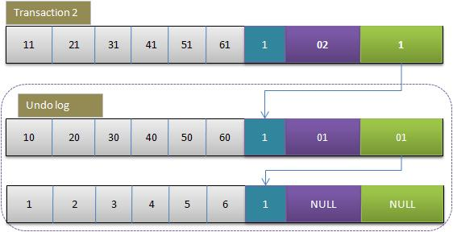

# InnoDB的MVCC机制原理

>在讲解InnoDB的MVCC机制之前，我们应该了解MySQL所支持的事务,以及各个事务级别的区别和每一个事务级别所存在的问题。

## 事务

>事务必须保证ACID，而ACID表示原子性、一致性、隔离性和持久性

### Innodb的事务相关概念

为了支持事务，Innbodb引入了下面几个概念：

1. redo log

    redo log就是保存执行的SQL语句到一个指定的Log文件，当Mysql执行recovery时重新执行redo log记录的SQL操作即可。当客户端执行每条SQL（更新语句）时，redo log会被首先写入log buffer；当客户端执行COMMIT命令时，log buffer中的内容会被视情况刷新到磁盘。redo log在磁盘上作为一个独立的文件存在，即Innodb的log文件。

2. undo log

    与redo log相反，undo log是为回滚而用，具体内容就是copy事务前的数据库内容（行）到undo buffer，在适合的时间把undo buffer中的内容刷新到磁盘。undo buffer与redo buffer一样，也是环形缓冲，但当缓冲满的时候，undo buffer中的内容会也会被刷新到磁盘；与redo log不同的是，磁盘上不存在单独的undo log文件，所有的undo log均存放在主ibd数据文件中（表空间），即使客户端设置了每表一个数据文件也是如此。

3. rollback segment

    回滚段这个概念来自Oracle的事物模型，在Innodb中，undo log被划分为多个段，具体某行的undo log就保存在某个段中，称为回滚段。可以认为undo log和回滚段是同一意思。

4. 锁

    Innodb提供了基于行的锁，如果行的数量非常大，则在高并发下锁的数量也可能会比较大，据Innodb文档说，Innodb对锁进行了空间有效优化，即使并发量高也不会导致内存耗尽。
    对行的锁有分两种：排他锁、共享锁。共享锁针对对，排他锁针对写，完全等同读写锁的概念。如果某个事务在更新某行（排他锁），则其他事物无论是读还是写本行都必须等待；如果某个事物读某行（共享锁），则其他读的事物无需等待，而写事物则需等待。通过共享锁，保证了多读之间的无等待性，但是锁的应用又依赖Mysql的事务隔离级别。

5. 隔离级别(下文详细介绍)

### 事务的隔离级别

事务可以通过**start transaction**语句开始一个事务，然后要么使用**commit**提交事务将所修改的数据持久保存，要么使用**rollback**撤销所有修改

1. READ UNCOMMITTED （未提交读 RU）

    在READ UNCOMMITTED级别，事务中的修改，即使没有提交，对其他事务也都是可见的。事务可以读取未提交的数据，这也被称为**脏读**。

2. READ COMMITTED （提交读 RC）

    大多数的数据库系统的默认隔离级别都是READ COMMITTED（MySQL 不是）。READ COMMITTED满足前面提到的隔离级别的简单定义：一个事务开始时，只能“看见” 已提交的事务所做的修改。换句话说，一个事务从开始知道提交之前，所做的任何修改对其他事务都是不可见的。这个级别也叫**不可重复读**，因为在同一事务内执行两次相同的查询，可能会得到不一样的结果。
    >例子： 当事务的隔离级别在RC级别的时候，事务A和事务B同时对数据D操作，当事务A开始的时候，读取的数据D保存下来了，这是事务B也在修改数据D，并且先于事务A提交。这是事务A再读数据D的时候，就会出现前后不一致情况，这就是所谓的不可重复读。

3. REPEATABLE READ （可重复读 RR）

    这是MySQL的默认事务隔离级别，它确保同一事务的多个实例在并发读取数据时，会看到同样的数据行。
    >例子：mysql的默认事务隔离级别是RR级别的，同样是上述例子，当时不同的是当事务A和事务B开始的时候，都保存一份自己的快照，每一份快照中都有数据D的值，所以这样在同一事务中，无论重读多少次都是正确的。

    不过理论上，这会导致另一个棘手的问题：**幻读** （Phantom Read）。简单的说，幻读指当用户读取某一范围的数据行时，另一个事务又在该范围内插入了新行，当用户再读取该范围的数据行时，会发现有新的“幻影” 行。InnoDB和Falcon存储引擎通过多版本并发控制（MVCC，Multiversion Concurrency Control）机制解决了该问题。

    >例子：在RR级别中，可能出现幻读。同样是上述例子，事务A和事务B同时查询数据D，事务A发现数据D为空，就想插入数据，但是这是事务B已经插入了数据D并且已经提交。这时事务A的提交就会出错。这是因为事务A的写操作是当前读操作。

4. SERIALIZABLE （可串行化 S）

    这是最高的隔离级别，它通过强制事务排序，使之不可能相互冲突，从而解决幻读问题。简言之，它是在每个读的数据行上加上共享锁。在这个级别，可能导致大量的超时现象和锁竞争。

    |隔离级别|脏读可能性|不可重复可能性|幻读可能性|加锁读|
    |--|--|---|----|---|---|
    |READ UNCOMMITTED|Yes|Yes|Yes|No|
    |READ COMMITTED|No|Yes|Yes|No|
    |REPEATABLE READ|No|No|Yes|No|
    |SERIALIZABLE|No|No|No|Yes|

## MVCC机制

InnoDB的**一致性的非锁定读**就是通过在MVCC实现的，Mysql的大多数事务型存储引擎实现的都不是简单的行级锁。基于提升并发性能的考虑，它们一般都同时实现了多版本并发控制（MVCC）。MVCC的实现，是通过保存数据在某一个时间点的快照来实现的。因此每一个事务无论执行多长时间看到的数据，都是一样的。所以MVCC实现可重复读。

* 快照读：select语句默认，不加锁，MVCC实现可重复读，使用的是MVCC机制读取undo中的已经提交的数据。所以它的读取是非阻塞的
* 当前读：select语句加S锁或X锁；所有的修改操作加X锁，在select for update 的时候，才是当地前读。

RR隔离级别下的快照读，不是以begin开始的时间点作为snapshot建立时间点，而是以第一条select语句的时间点作为snapshot建立的时间点。

### MVCC的数据依赖

行记录隐藏字段

* db_row_id，行ID，用来生成默认聚簇索引（聚簇索引，保存的数据在物理磁盘中按顺序保存，这样相关数据保存在一起，提高查询速度）
* db_trx_id，事务ID，新开始一个事务时生成，实例内全局唯一
* db_roll_ptr，undo log指针，指向对应记录当前的undo log
* deleted_bit，删除标记位，删除时设置(下文省略)

undo segment

* 用于行记录回滚，同时用于实现MVCC
    

### MVCC操作

#### 更新

下面演示下事务对某行记录的更新过程：

1. 初始行数据

    
    F1～F6是某行列的名字，1～6是其对应的数据。后面三个隐含字段分别对应该行的事务号和回滚指针，假如这条数据是刚INSERT的，可以认为ID为1，其他两个字段为空。

2. 事务1更改该行的各字段的值

    
    当事务1更改该行的值时，会进行如下操作：
    * **用排他锁锁定该行**
    * 记录redo log
    * 把该行修改前的值Copy到undo log，即上图中下面的行
    * 修改当前行的值，填写事务编号，使回滚指针指向undo log中的修改前的行

3. 事务2修改该行的值

    
    与事务1相同，此时undo log，中有有两行记录，并且通过回滚指针连在一起。
    因此，如果undo log一直不删除，则会通过当前记录的回滚指针回溯到该行创建时的初始内容，所幸的时在Innodb中存在purge线程，它会查询那些比现在最老的活动事务还早的undo log，并删除它们，从而保证undo log文件不至于无限增长。

4. 事务提交

    当事务正常提交时Innbod只需要更改事务状态为COMMIT即可，不需做其他额外的工作，而Rollback则稍微复杂点，需要根据当前回滚指针从undo log中找出事务修改前的版本，并恢复。如果事务影响的行非常多，回滚则可能会变的效率不高，根据经验值没事务行数在1000～10000之间，Innodb效率还是非常高的。很显然，Innodb是一个COMMIT效率比Rollback高的存储引擎。据说，Postgress的实现恰好与此相反。

#### 插入

上述更新过程确切地说是描述了UPDATE的事务过程，其实undo log分insert和update，因为insert时，原始的数据并不存在，所以回滚时把insert undo log丢弃即可，而update undo log则必须遵守上述过程。

#### 删除

和update一样，只增加deleted_bit设置

### MVCC实现RR

* RR定义：在一个事务内同一快照读执行任意次数，得到的数据一致；且只能读到第一次执行前已经提交的数据或本事务内更改的数据
* 原理：对符合查询条件的记录进行可见性判断（就是那些数据本事务可以看见，那些数据看不见）
* read view：记录当前处于活动状态的所有事务ID，RR级别下，第一次快照读时创建，RC级别下，每次快照读均会创建新的
* 缺点： 可能出现幻读

    
    

## MVCC过程总结

* 事务以排他锁的形式修改原始数据
* 把修改前的数据存放于undo log，通过回滚指针与主数据关联
* 修改成功（commit）啥都不做，失败则恢复undo log中的数据（rollback）
